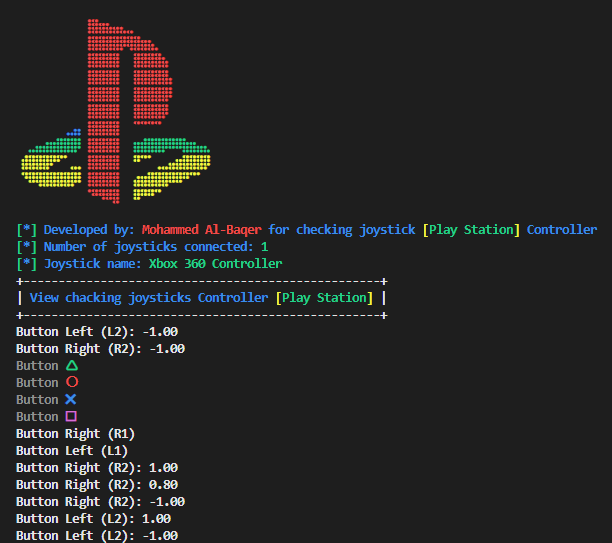
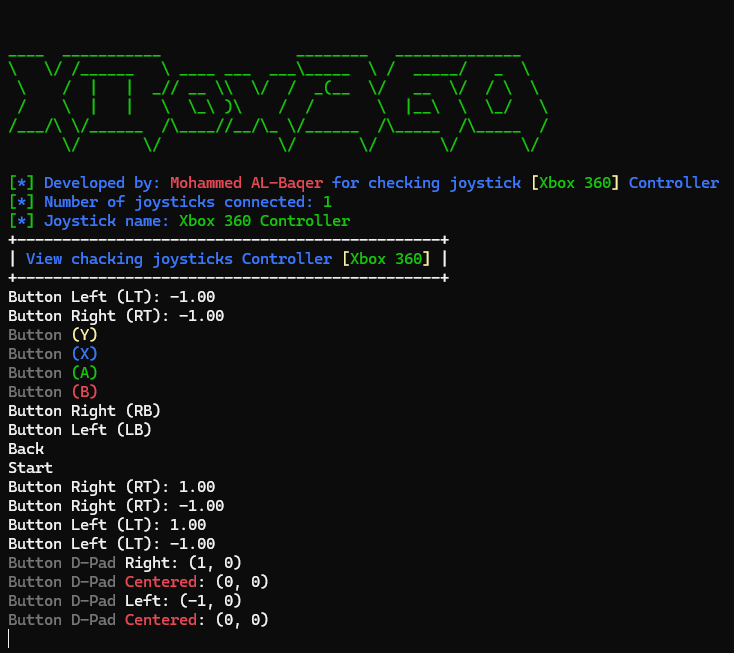

### chacking joystick for Play station and Xbox 
### setup package for python 
```
$ pip3 install -r requirements
```
### Run for joystick play station by termimal [](#)
```
$ python PlayStation.py
```

### Run for joystick Xbox by termimal <span style="background-color:green; color:white; padding:4px 10px; border-radius:5px; font-weight:bold; display:inline-flex; align-items:center;">
   Xbox
</span>
```
$ python Xbox.py
```

### To display as an interactive web page
```
$ index.html
```
